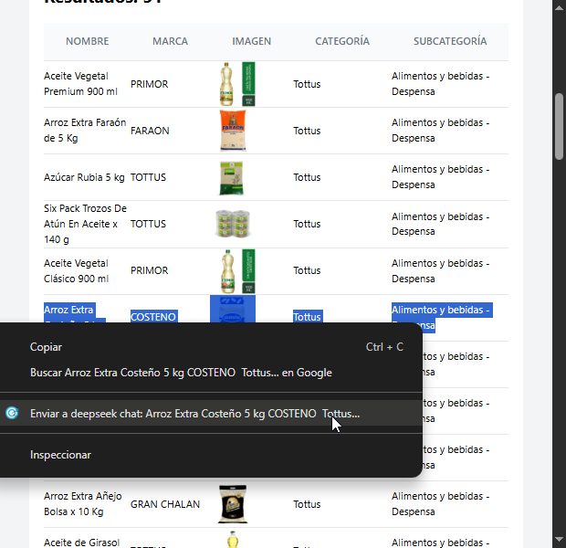
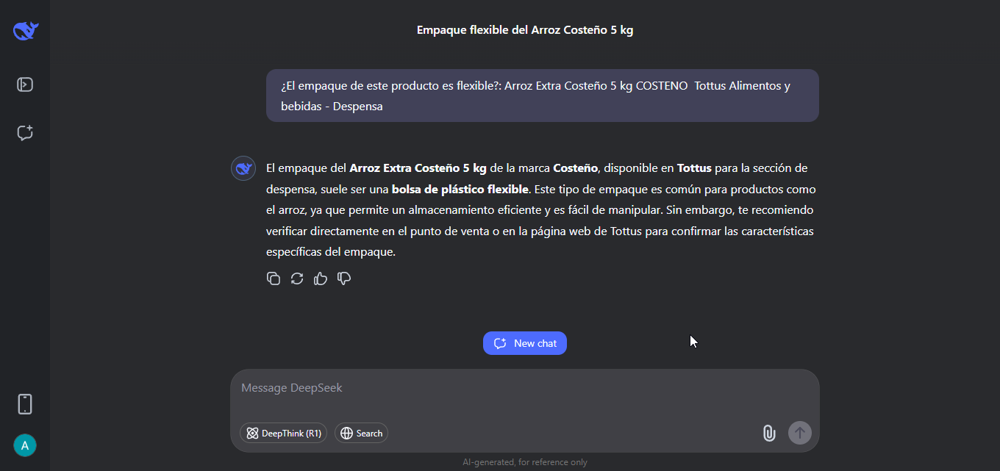
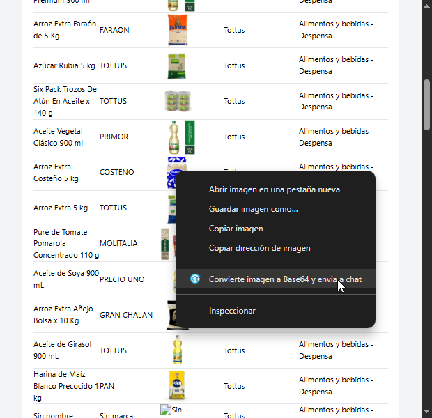
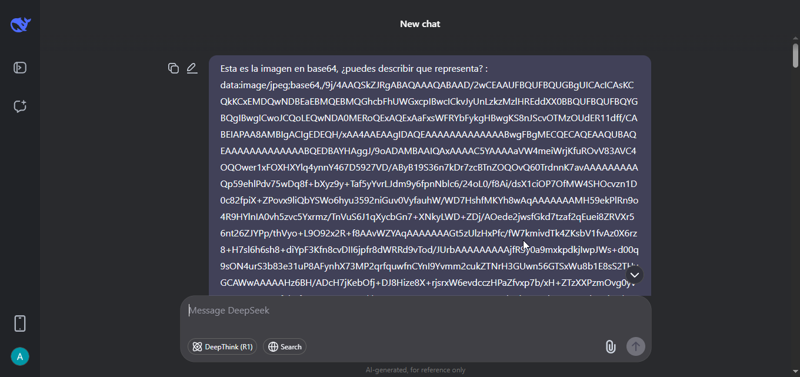
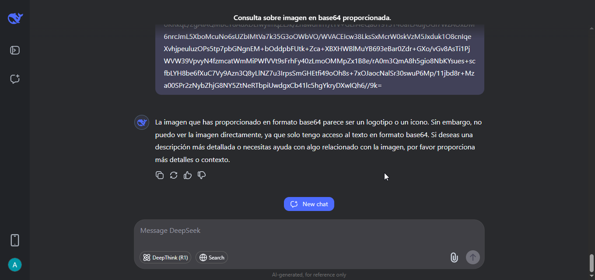

## Instalación

Instalar módulos

```
yarn install

```

Crear dist folder

```
yarn build

```

Opcional (para realizar build en cada cambio)

```
yarn start

```

## Scraping

Información de cada producto:
     - Categoría
     - Subcategoría
     - Nombre
     - Marca
     - Imagen (URL)


## Navegación para el scraping

Se obtienen las categorías (links) y subcategorías(botones) del DOM usando content script.

Se guardan en extension storage con propiedades como text, id, href, visited = false

Hay 1 btn para empezar a navegar
- En click visitará cada category page y cambiará su visited de false a true.
- Para pasar de página inicial a page 2, page 3,... actualizará el url usando `?page=n`.
- Cuando termine de visitar todas las páginas de la categoria. Pasará a la siguiente categoria que tenga visited:false

- Cuando no haya más, se detendrá y regresará a Despensa

Notas: La categoría de Harinas tiene muchas páginas, por lo que se limitó a 5. Ver en popup.ts 


## Deepseek

Menús contextuales (2) agregados.
Se abrirá chat de deepseek en nuevo tab y se pegará y dará click en Enter automáticamente.
Solo necesita tener iniciada sesión en <https://chat.deepseek.com/> (no API)

1. Envía cualquier texto seleccionado (por ejemplo un row de la tabla del popup, o texto cualquier web) junto al prompt `¿El empaque de este producto es flexible?:`
Da la respuesta más probable.





2. Convierte cualquier imagen a base64 y la envía junto a un prompt `Esta es la imagen en base64, ¿puedes describir que representa? :`
No, no puede saber qué imagen es.






O puedes enviarle el csv a deepseek y decirle : '¿Puedes devolverme este mismo archivo, agregando la columna de 'Empaque Flexible' (cuyos valores pueden ser 'SI' o 'NO' dependiendo del producto y características?' <deepseek.csv>
